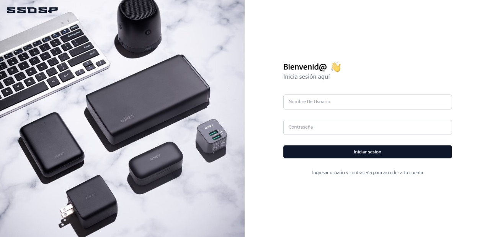
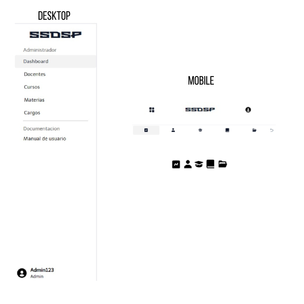

<!-- Las imágenes en Starlight utilizan el [soporte de assets optimizados incorporado en Astro](https://docs.astro.build/en/guides/assets/). -->

Para poder ingresar a la aplicación, al secretario/a se le asigna una cuenta de administrador para ingresar a la aplicación, con usuario y contraseña únicos.

##  Barra lateral de navegación

En la barra lateral de navegación se encuentran todos los accesos a las funciones de administrador en el caso del secretario.
Junto con otro acceso hacia el manual de usuario.
Y en la parte inferior, la sesión del usuario.

 

Por temas de tamaño de pantalla, para los dispositivos móviles la barra de navegación se encuentra en la parte inferior.
Al presionar la parte izquierda se abre un pequeño menú donde se encuentran todos los accesos a las funciones de la aplicación.
En la parte derecha las opciones de la cuenta del usuario.

| Icono de la bitácora (dashboard) |  |
|-----------------------------------|------------------------------------------------------------------------|
| Icono de docentes                 |  |
| Icono de materias                 |  |
| Icono de cargos                   |  |

Aprende más sobre el funcionamiento de la aplicación en la [Documentación en pdf](https://docs.astro.build/es/core-concepts/astro-syntax/#html-dinamico).