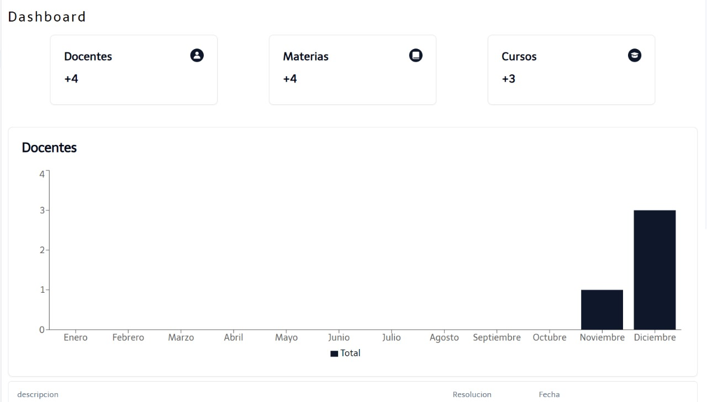
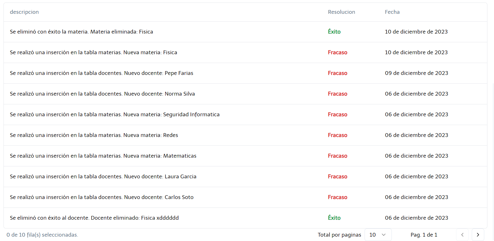

En esta ventana se muestran los registros de la información que se fue guardando durante el uso de la aplicación.

- Un vistazo rápido a métricas claves incluyendo docentes, materias y cursos.

- Gráficos con tendencias recientes.

- Tabla de registros con resumen y descripción general de las últimas modificaciones.

