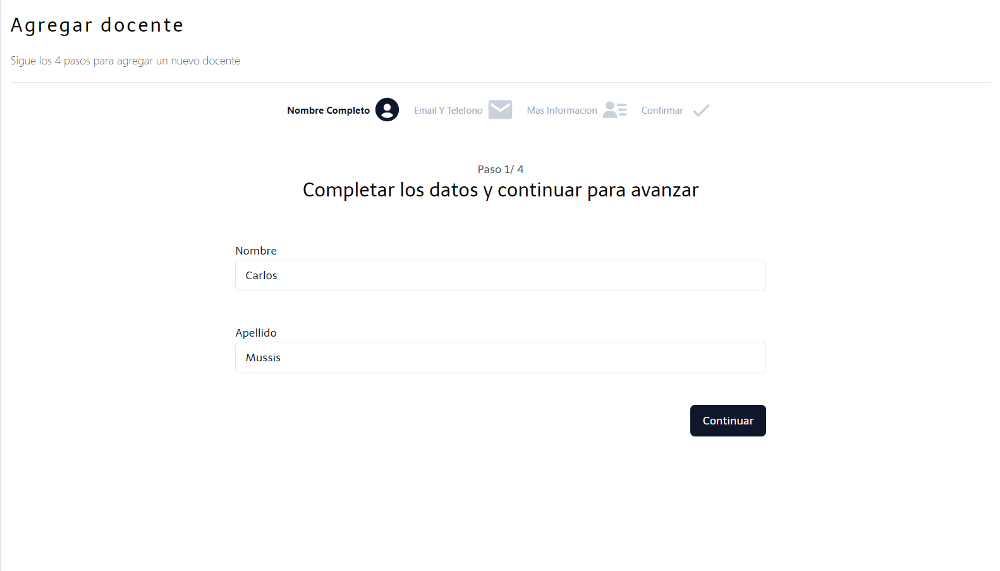
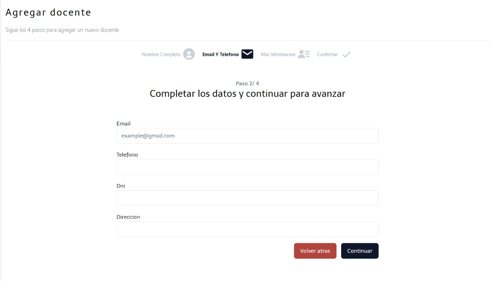
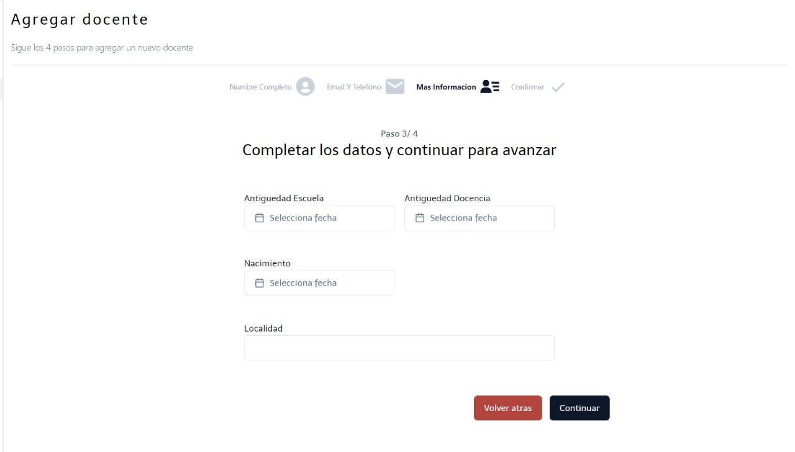

En la ventana de agregar docente, se deben de seguir 4 pasos fundamentales en los cuales se ingresa la informacion del docente. Para continuar se debe completar los formularios correspondientes.

Al entrar a la ventana, lo primero en aparecer es un formulario en el cual se debe rellenar con nombre y apellido del docente.

En este paso, en este se debe rellenar con el email, telefono, DNI y direcciín del docente.

Ya realizado el paso anterior, en este nuevo, se debe de rellenar con la antiguedad escuela, antiguedad docencia, fecha de nacimiento y localidad del docente.

En este último paso, se muestra la informacion previamente ingresada, este paso funciona para confirmar la información que se ingresó del docente.
