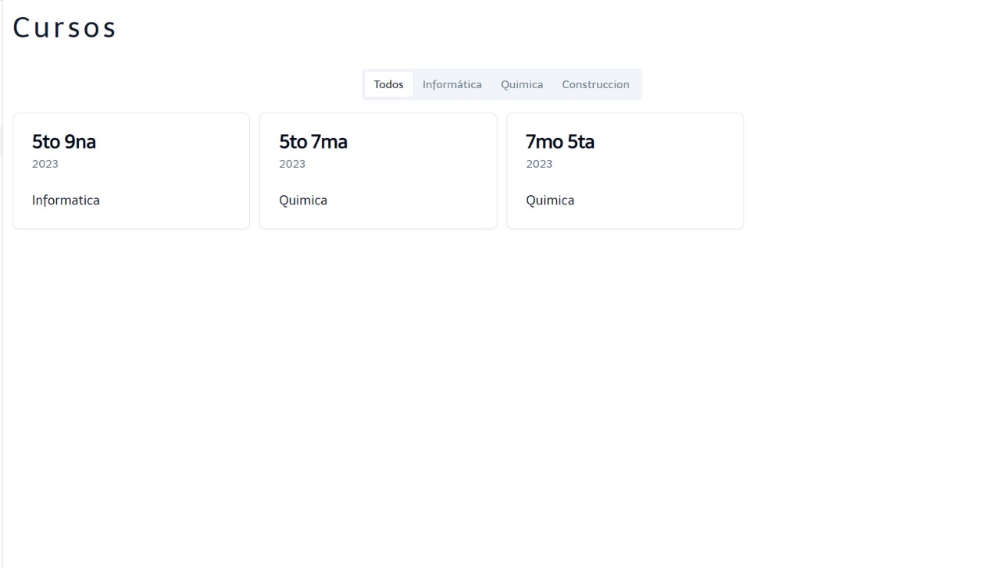
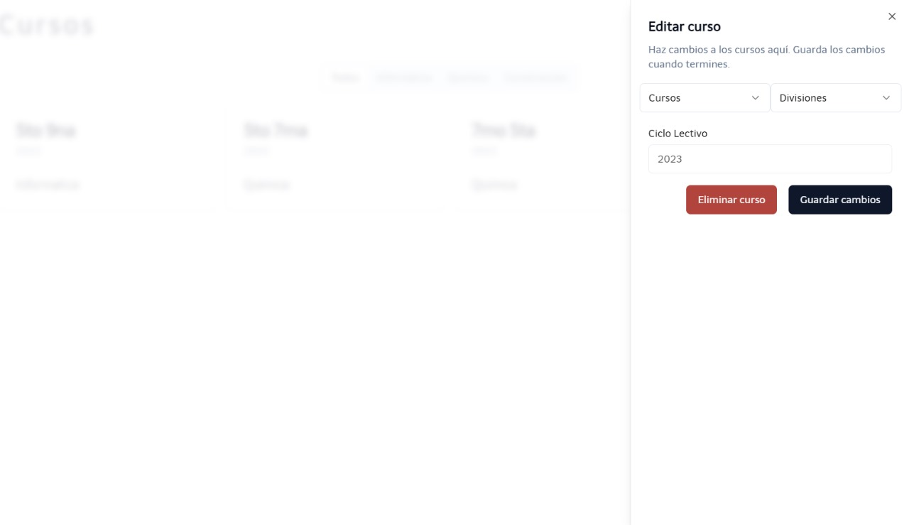

En la ventana Agregar Curso, se selecciona las opciones con la información del mismo.

Seleccionar la información de la especialidad, la divisiín del curso. EL ciclo lectivo se selecciona automaticamente según el año actual.

Luego de completar la anterior ventena, se encuentran los cursos previamente agregados. Y además, de una barra la cual funciona para filtrar cursos por especialidad.

En caso de querer modificar o eliminar el curso, se logra presionando sobre el que desea realizar dicha acción.

:::caution
En caso de que quieras eliminar un curso ya asignada a un cargo, se mostrará una alerta de error para notificarte que actualmente que dicho curso está siendo ocupado..
:::

