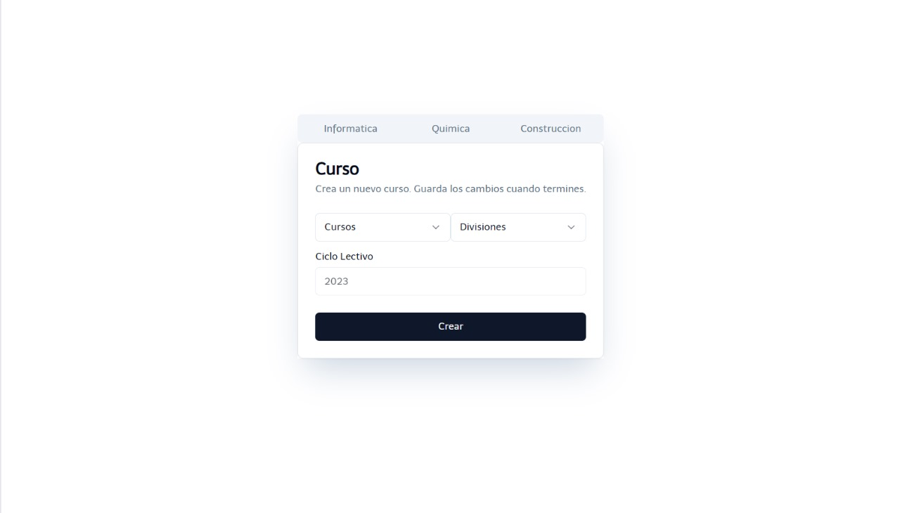

En la ventana Agregar Curso, se selecciona las opciones con la información del mismo.

En la ventana se selecciona la información de la especialidad, la divisiín y el ciclo lectivo (según el año actual) del curso.

Luego de completar la anterior ventena, se encuentran los cursos previamente agregados. Y además, de una barra la cual funciona para filtrar cursos por especialidad.

En caso de error con la informacion del curso, se edita precionando el curso erroneo y luego se lo modifica o elimina.

