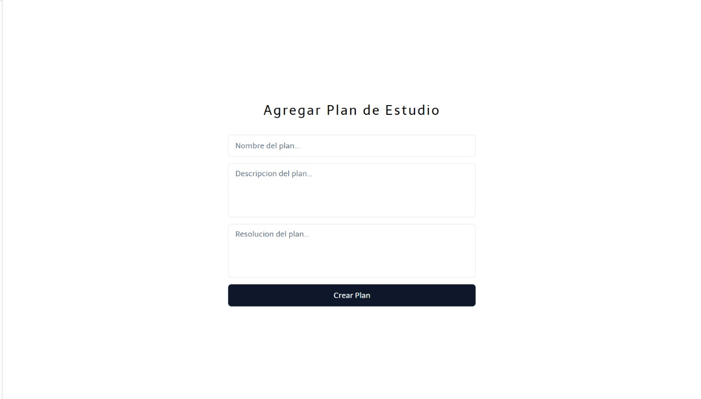
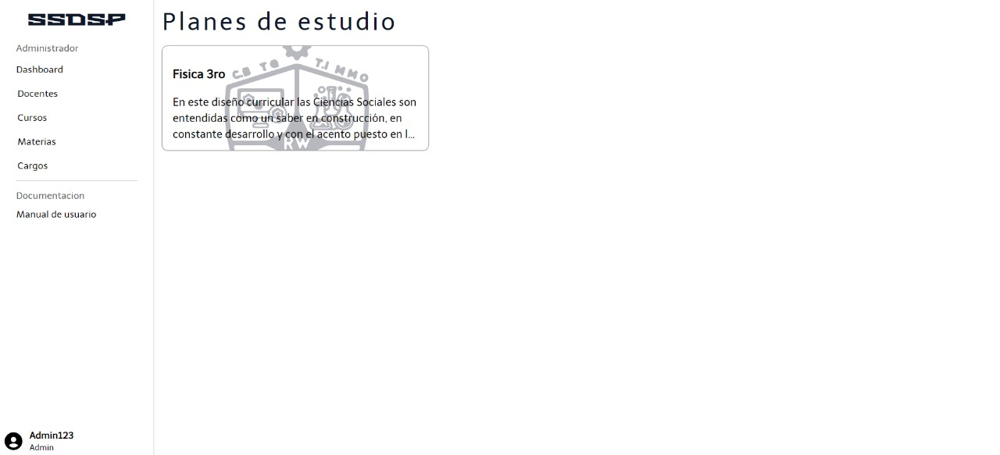
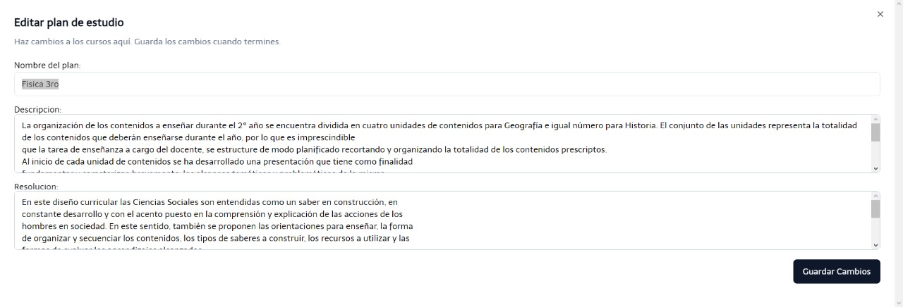

En la ventana Agregar Plan de Estudio, se debe de ingresar informacion fundamental del mismo.

La ventana presenta un formulario, en el cual se debe de ingresar informacion fundamental, tales como nombre, descripcion y resolucion del plan de estudio.

Luego de completar la anterior ventena, se encuentran los diferentes planes de estudios previamente agregados.

En caso de error con la informacion del plan de estudio, se edita precionando el plan de estudio errono y luego se lo modifica.

