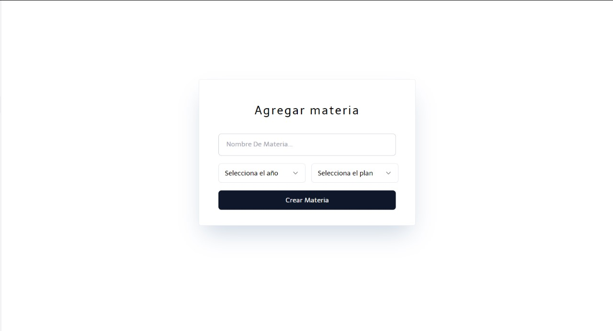
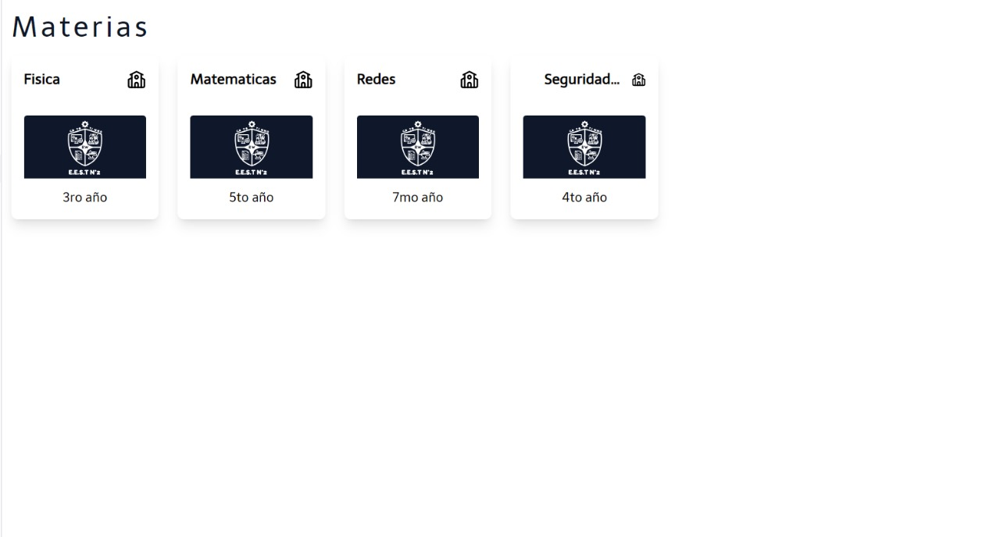
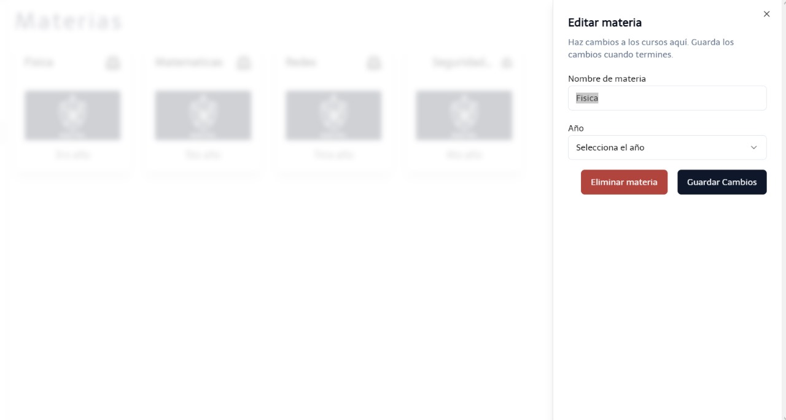

Se debe de ingresar información de la materia, tales como el nombre, el año del curso y el plan de estudio de la materia.

Luego de completar la anterior ventena, se encuentran las diferentes materias previamente agregados.

En caso de actualizar la información de la materia una vez creada, el usuario puede modificar los datos antes insertados.

