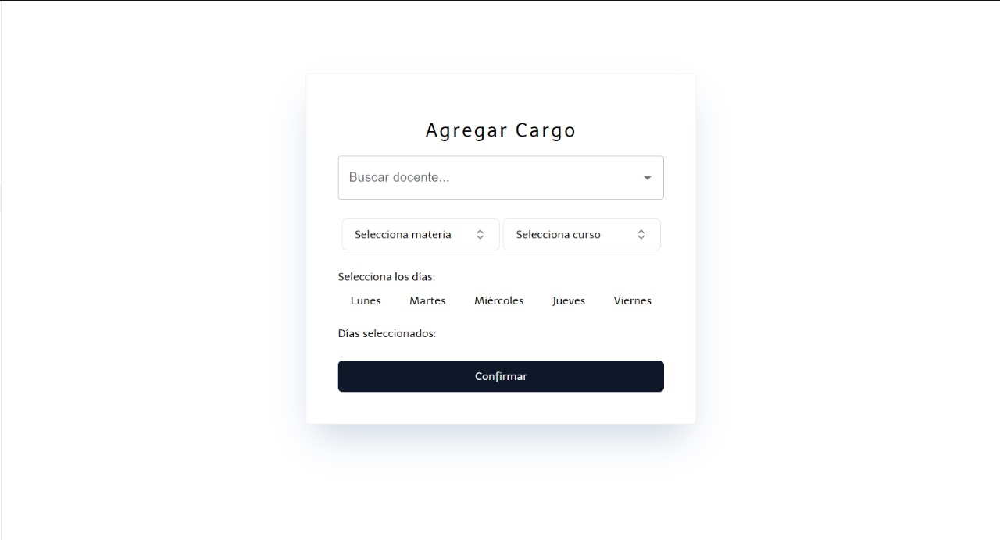
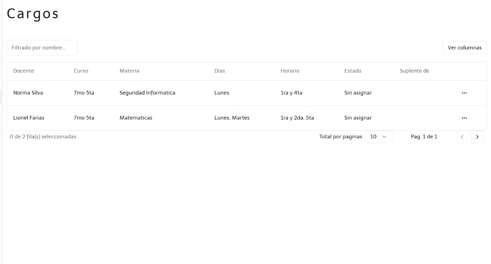
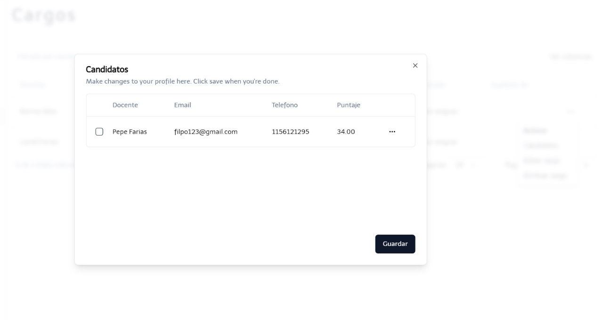
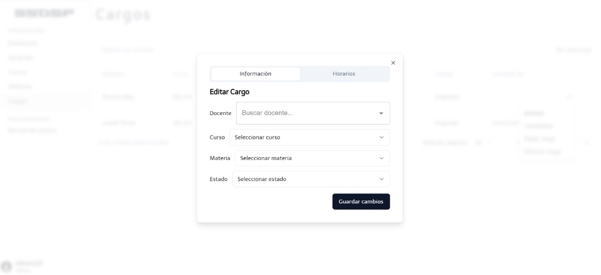
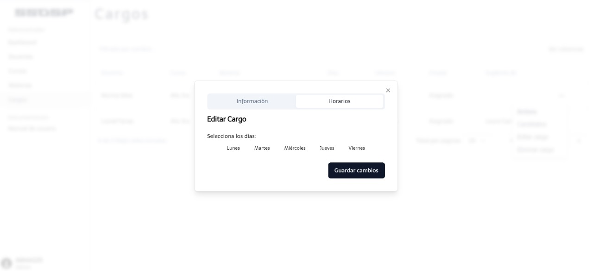
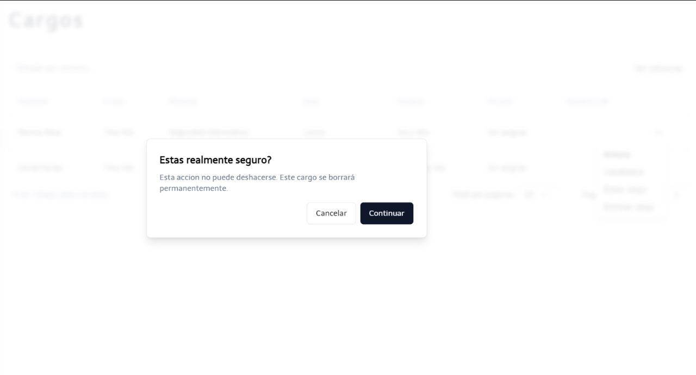

En la ventana Agregar Cargo, se debe de ingresar informacion fundamental del mismo.

En la ventana se debe de seleccionar informacion fundamental, tales como el nombre del docente, la materia, el curso, el dia y hora del cargo a agregado

Luego de completar la anterior seleccion, se encuentran los diferentes cargos previamente agregados.

Al presionar en los `...` se muestran varias opciones, entre ellas: "Candidatos", "Editar cargo" y "Eliminar cargo"

En caso de que el cargo se encuentre sin asignar, se muestra al mejor candidato presionando en `...`. Luego se visualiza una ventana con los candidatos y la opcion de notificarles via email si quieren tomar el cargo vacante. Si el docente confirma al email, el administrador puede seleccionar al candidato y confirmar para que se modifique el cargo con el nuevo candidato.

Al elegir la opción de "Editar cargo", se le permite al usuario modificar la información que desee acerca del cargo con la información correspondiente.

:::caution
En caso de que quieras cambiar de docente al modificar el cargo, ten en cuenta que debe ser un docente que sea apto a dictar la materia (que figura en su oblea). En caso de que no sea así, se mostrará una alerta de error..
:::

La opción de "Eliminar cargo", se le permite al usuario eliminar dicho cargo.

